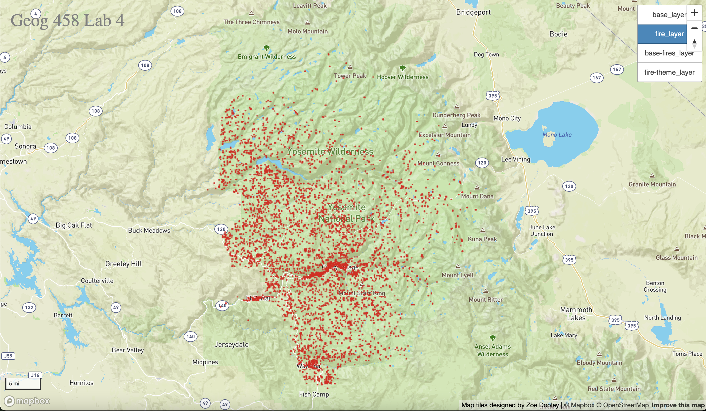

# yosemite_fires

I created a web map centered on Yosemite National Park that allows users to turn on and off four different map layers. The map can be found under [this link](https://zoedooley00.github.io/yosemite_fires/). The first tileset is titled "base_layer", the second is called "fire_layer", the next is called "base-fires_layer", and the last is called "fire-theme_layer". All four of these tilesets were generated by QTiles in QGIS, and they all have ten zoom levels (1-10). On the map itself there is a scale bar on the bottom left hand side that allows users to gauge the distance in imperial units. The map also has a zoom bar on the upper right hand side that allows users to adjust to zoom level of the layers. Lastly, there is a toggle layer switcher that makes it possible to add and remove the layers.

## Base Layer

This tileset is a [Mapbox](https://www.mapbox.com) basemap customized from the original Midnight base. I lightened the color to a light lavendar shade and customized the fonts as well as the icons. 

## Fire Layer

This tileset was based off of geospatial data derived from [van Wagtendonk K. 2020. 2019 Fire Ignition History for Yosemite National Park](https://irma.nps.gov/DataStore/Reference/Profile/2271859). The data shows ignition points in Yosemite from 1930 through 2019. Each point is a dark orange-red shade to resemble the color of fire.

## Base and Fire Layer

This tileset is a combination of the base layer and fire layer mentioned above. 

## Fire Theme Layer

This tileset was designed to appear as a fire theme. I integrated different yellows, reds, and oranges to symbolize the different colors of a fire on a black base color to make the colors pop more. I also customized the font to appear more aggresive and harsh. Because the map is so zoomed into a point of interest/forest area, I did not change the icons because it had minimal effect.
